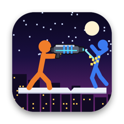
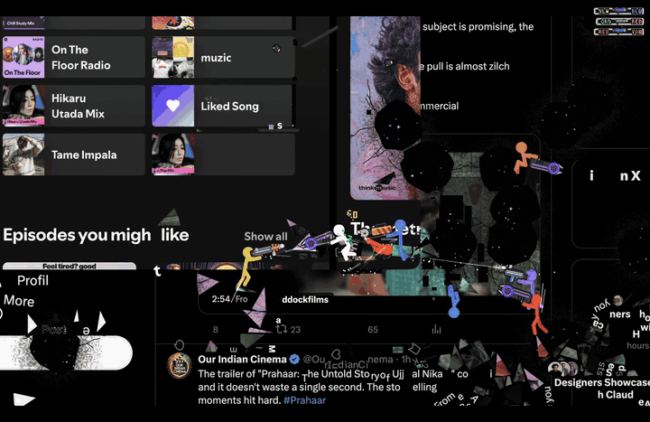
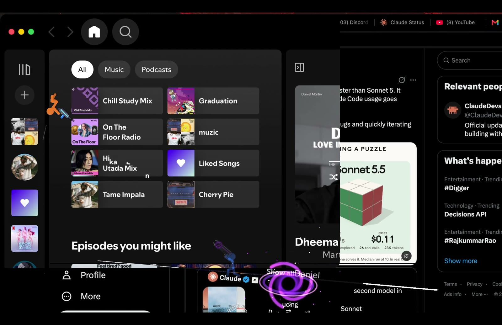
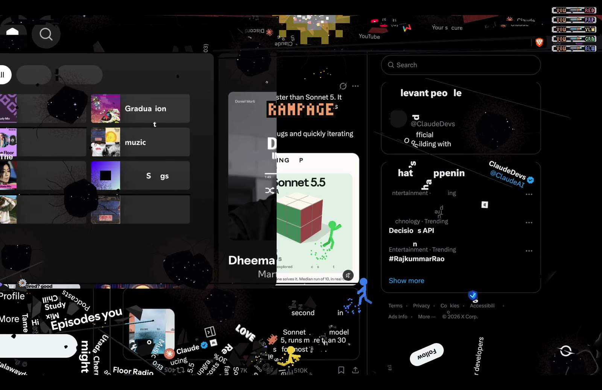
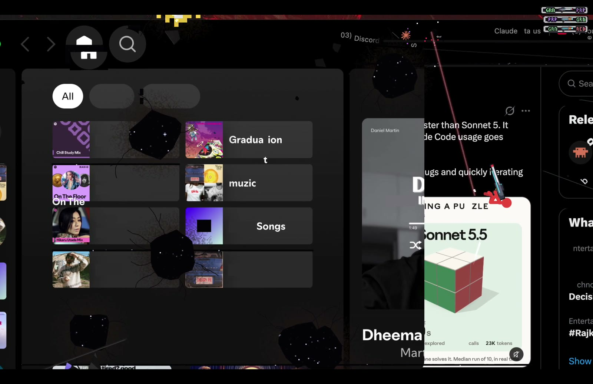
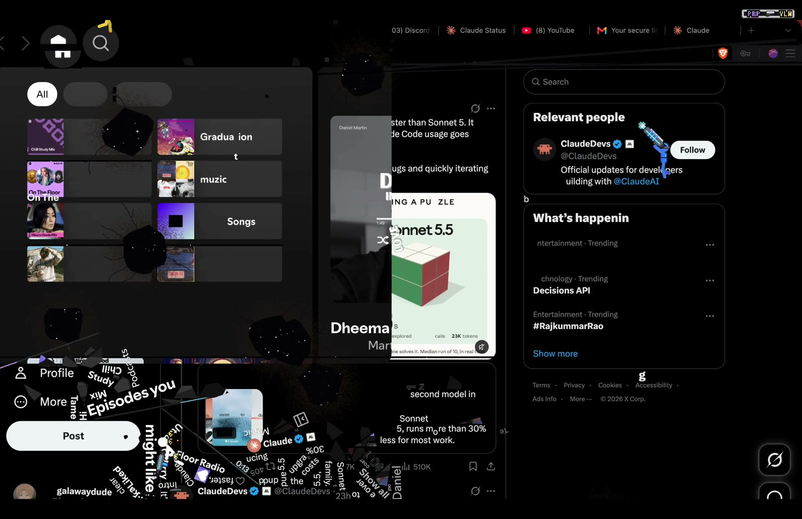
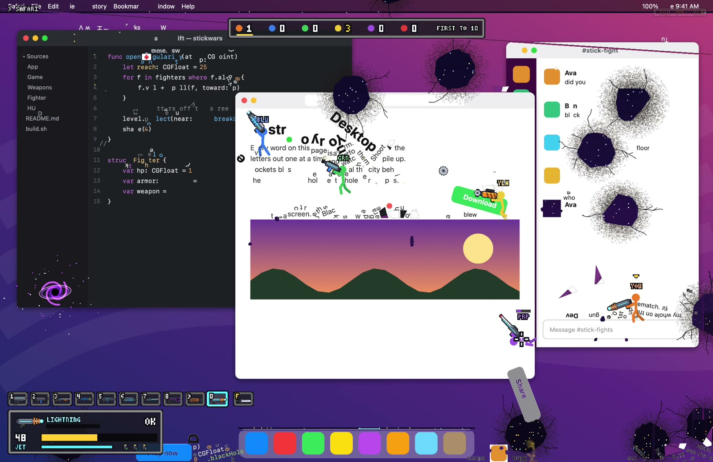

<p align="center"></p>

<h1 align="center">STICKWARS</h1>

<p align="center"></p>

<p align="center"><b><a href="https://github.com/galawaydude/stickwars/releases/download/v1.0/stickwars-gameplay.mp4">watch the full video</a></b></p>

I always thought Alan Becker's stick figure animations were pretty cool. You know the ones, where the
stick guy crawls out of the screen and starts wrecking the desktop. I wanted to see if Opus 5.5 could help
me build something like that, and it kind of did.

You press ⌥⇧F on whatever you have open. Your screen freezes and turns into the level. Every word,
button, icon and title bar is something you can stand on, and you're dropped in with a bunch of stick
figure bots and way too many guns. Shoot the letters out one by one, blow holes in the screen, throw a
black hole at someone's tweet. Press Esc and you get your desktop back like nothing happened.

It never touches your actual apps. It just takes one screenshot and fights on top of that.

## what it looks like

That's my real screen, Spotify sitting on top of X, a few seconds in. The letters are getting shot out
of the playlist names and the holes are where the screen got blown open, there's just black space behind it:



The slow-mo kicks in whenever you get a kill, the camera zooms in and the letterbox bars slide in:



Everything that breaks off is a real physics object, so by the end there's a huge pile of words,
Follow buttons and Dock icons at the bottom of the screen:





And it works on anything. This one's a made-up desktop with a code editor, a blog post and a chat app:



## stuff in it

- 10 guns: pistol, SMG, shotgun, rocket launcher, plasma rifle, charged blaster, a laser that slices a
  whole row of letters, a **black hole gun** that sucks in words, debris and players before collapsing,
  a **saw launcher** that bounces around cutting through text, and a **lightning gun** that chains
  between people. Plus grenades and a knife.
- Armour you can pick up (you can actually see the vest and helmet on the guy), health packs.
- Double jumps are front flips, wall jumps, a jetpack, dropping through lines of text.
- Deaths are ragdolls. They fly off and pile up with everything else.
- Bots that path-find across the screen, pick weapons by range, go for health when they're hurt.
- Free for all, first to 10 kills.
- All the art (guns, icon, the space behind the screen) is drawn in code, and all the sounds are
  synthesized. There are no image or audio files in the game.

## install

You need a Mac with Apple Silicon on macOS 14 or newer, plus the command line tools
(`xcode-select --install`).

```sh
git clone https://github.com/galawaydude/stickwars.git
cd stickwars
./install.sh
```

That builds it, puts it in /Applications and opens it. A setup window pops up asking for two
permissions:

- **Screen Recording** is the one it really needs, that's how it grabs the picture of your screen. macOS
  only applies it after the app restarts, so hit **Relaunch** in the setup window after turning it on.
- **Accessibility** is optional. It lets the game know exactly where the buttons and text are so the
  stick guys stand on them perfectly. Without it the game just figures that out from the pixels.

After that it lives in the menu bar (the little boxing guy). Press ⌥⇧F anywhere to play.

## controls

| key | what it does |
| --- | --- |
| A / D | move |
| W or Space | jump, press again in the air to flip |
| S | drop through a line of text |
| Shift | jetpack |
| mouse | aim and shoot (hold to keep firing, hold and let go to charge the blaster) |
| right click | grenade |
| F | knife |
| 1 to 0, or scroll | switch guns |
| R | reload |
| Esc or ⌥⇧F | pause and get your desktop back |

The menu bar icon lets you change the number of bots (0 to 5) and the difficulty, or mute it.
